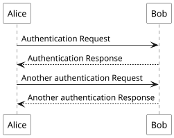
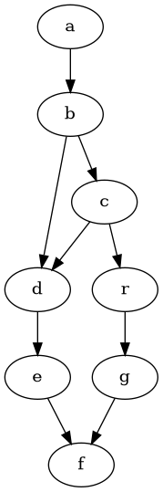

<!-- .slide: class="titolo" data-background-image="./sfondi/Titolo.webp" data-background-size="contain"-->

# AI1 Divertiamoci con Python
## FUTURO: Formazione innovativa e pratica UTilizzando laboratori congiUnti per la tRasfOrmazione digitale
### Docente: Ing. Sandro Zacchino, PhD
### email: sandro.zacchino@unisalento.it

---

<!-- .slide: class="roadmap h1-fontsize-40 h1-align-left" data-background-image="./sfondi/Roadmap.webp" data-background-size="contain" -->
# Introduzione con titolo lungo assai

Lorem ipsum dolor sit amet consectetur adipisicing elit. Sint, quos nesciunt eligendi tempora facere numquam modi alias provident animi iure voluptates amet ipsum nobis harum rerum consequatur quod, iusto perferendis.pisicing elit. Sint, quos nesciunt eligendi tempora facere numquam modi alias provident animi iure voluptates amet ipsum nobis harum rerum consequatur quod, iusto perferendis.



---

<!-- .slide: class="roadmap h1-fontsize-50 h1-align-left" data-background-image="./sfondi/Roadmap.webp" data-background-size="contain" -->
# Test

!!!example Esercizio
    Descrivere un modello entità - relazione per i seguenti casi d'uso:
    - Un cliente prenota un tavolo ad un ristorante ed ordina un certo numero di pietanze usando un tablet sul tavolo; si vogliono tracciare gli ordini fatti dai clienti;
    - Un visitatore visita una collezione di opere d'arte; per ognuna usa il suo smartphone per inquadrare un QR Code ed visualizzare un video con un approfondimento sull'opera; si vogliono tracciare le opere d'arte che destano la curiosità dei visitatori;
    - Un cliente prenota una stanza presso un B&B avendo la possibilità di visualizzare le caratterisiche della stanza: quantità di letti singoli, quantità di letti matrimoniali, bagno in camera, vasca da bagno, balcone e foto; si vogliono censire le stanze e memorizzare le prenotazioni dei clienti


---

<!-- .slide: class="roadmap" data-background-image="./sfondi/Roadmap.webp" data-background-size="contain"-->
# Codice


!!!info Fun Fact
    this is a `abstract` type admonition. The warning above was a `abstract` type admonition

---

<!-- .slide: class="roadmap h1-fontsize-30" data-background-image="./sfondi/Roadmap.webp" data-background-size="contain" -->

# plantuml con testo plantuml con testo plantuml con testo 

<div class="row">
<div class="col-9">


```bash
$ gcc prova.c -o a.exe
```
Lorem ipsum dolor, sit amet consectetur adipisicing elit. Recusandae ea minima blanditiis voluptatibus totam laborum natus, a cupiditate explicabo iusto tempora dignissimos molestiae? Nam, rem sequi vero fuga velit blanditiis?

- primo
- secondo
- terzo
</div>
<div class="col-3">

</div>

---
<!-- .slide: class="roadmap" data-background-image="./sfondi/Roadmap.webp" data-background-size="contain"-->

# plantuml


---

<!-- .slide: class="opzioni h1-fontsize-30 h1-align-left" data-background-image="./sfondi/Opzioni.webp" data-background-size="contain" -->
# Introduzione con titolo lungo assai ma veramente veramente veramente assai

Lorem ipsum dolor sit amet consectetur adipisicing elit. Sint, quos nesciunt eligendi tempora facere numquam modi alias provident animi iure voluptates amet ipsum nobis harum rerum consequatur quod, iusto perferendis.pisicing elit. Sint, quos nesciunt eligendi tempora facere numquam modi alias provident animi iure voluptates amet ipsum nobis harum rerum consequatur quod, iusto perferendis.


---