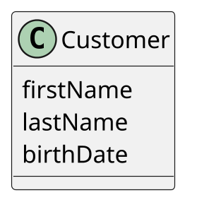
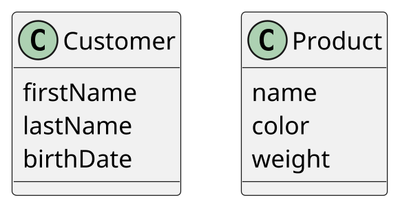
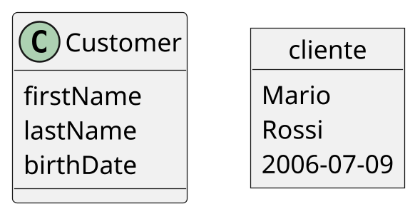
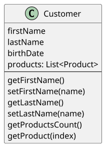
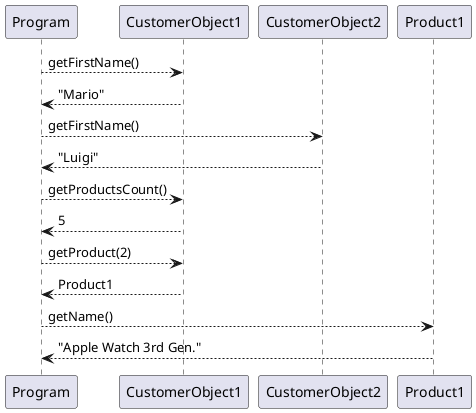

<!-- .slide: class="titolo" data-background-image="./sfondi/Titolo.webp" data-background-size="contain" data-transition="concave" -->

# AI1 Divertiamoci con Python
## FUTURO: Formazione innovativa e pratica UTilizzando laboratori congiUnti per la tRasfOrmazione digitale
### Docente: Ing. Sandro Zacchino, PhD
### email: sandro.zacchino@unisalento.it

---
<!-- .slide: class="cosa-impareremo h1-fontsize-30 h1-align-left" data-background-image="./sfondi/Cosa Impareremo.webp" data-background-size="contain" -->
# Cosa Impareremo

- Utilizzo di Google Colab per lo sviluppo Python
- Coding in Python
- Applicazioni di Python

---

<!-- .slide: class="roadmap h1-fontsize-40 h1-align-left" data-background-image="./sfondi/Roadmap.webp" data-background-size="contain" -->
# Google Colab

**Colab**, o *Colaboratory*, ti permette di scrivere ed eseguire Python nel tuo browser con:
- Nessuna configurazione necessaria
- Accesso alle GPU senza costi
- Condivisione semplificata

Che tu sia <strong>studente</strong>, <strong>data scientist</strong> o <strong>ricercatore AI</strong>, Colab può semplificarti il lavoro. 

---
<!-- .slide: class="roadmap h1-fontsize-40 h1-align-left" data-background-image="./sfondi/Roadmap.webp" data-background-size="contain" -->
# Google Colab

Anche se utilizzeremo la versione gratuita di Google Colab:

- Ogni Notebook di Colab è una Macchina Virtuale Linux in Cloud dotata di determinate risorse hardware
- Possiamo eseguire alcune installazioni 
- di pacchetti e di applicazioni
- Ad esempio possiamo compilare codice C / C++

---

<!-- .slide: class="roadmap h1-fontsize-40 h1-align-left" data-background-image="./sfondi/Roadmap.webp" data-background-size="contain" -->
# Google Colab

Con Python:

- Possiamo installare librerie aggiuntive, se assenti
- Possiamo eseguire un Web Server, ad esempio con Flask
- Possiamo creare file, collegarci al nostro Google Drive

---

<!-- .slide: class="roadmap h1-fontsize-40 h1-align-left" data-background-image="./sfondi/Roadmap.webp" data-background-size="contain" -->
# Google Colab

!!!warning Attenzione!
	Non creare, all'interno dello spazio del notebook, file di cui non avete copia sul vostro computer: potreste perderli!

---

<!-- .slide: class="opzioni h1-fontsize-40 h1-align-left" data-background-image="./sfondi/Opzioni.webp" data-background-size="contain" -->

# Object Oriented Programming

Il termine più corretto sarebbe **Class Oriented Programming**

È un approccio che si basa sul concetto di _Classe_ e di _Oggetto_.

---

<!-- .slide: class="opzioni h1-fontsize-40 h1-align-left" data-background-image="./sfondi/Opzioni.webp" data-background-size="contain" -->

# Cos'è una Classe

Una Classe è uno schema che rappresenta una categoria di dati accomunati da specifici attributi

Un attributo è un dato.
---

<!-- .slide: class="opzioni h1-fontsize-40 h1-align-left" data-background-image="./sfondi/Opzioni.webp" data-background-size="contain" -->

# Esempio di classe: Customer

Un customer è un cliente di un e-commerce o un cliente in generale. I suoi attributi possono essere:
- nome
- cognome
- data di nascita

---

<!-- .slide: class="opzioni h1-fontsize-40 h1-align-left" data-background-image="./sfondi/Opzioni.webp" data-background-size="contain" -->

# Esempio di classe: Product

Un product è un generico prodotto che può essere acquistato
- nome
- colore
- peso

---

<!-- .slide: class="opzioni h1-fontsize-40 h1-align-left" data-background-image="./sfondi/Opzioni.webp" data-background-size="contain" -->

# Cos'è un oggetto

Un oggetto è l'utilizzo di una classe. Vediamolo schematicamente:

---

<!-- .slide: class="opzioni h1-fontsize-40 h1-align-left" data-background-image="./sfondi/Opzioni.webp" data-background-size="contain" -->
# Programmazione ad oggetti

La programmazione ad oggetti prevede quindi che i dati *propri* di una certa entità siano **incapsulati** all'interno di un oggetto che la rappresenta.

Come leggiamo e scriviamo questi dati?

Ogni classe definisce anche delle funzioni o **metodi** con i quali accedere ai *propri* dati oppure elaborarli.

---

<!-- .slide: class="opzioni h1-fontsize-40 h1-align-left" data-background-image="./sfondi/Opzioni.webp" data-background-size="contain" -->

# Esempio di classe: Customer

Per un customer vogliamo accedere ai suoi dati personali o agli acquisti fatti:

---

<!-- .slide: class="opzioni h1-fontsize-40 h1-align-left" data-background-image="./sfondi/Opzioni.webp" data-background-size="contain" -->

# Esempio di programma OOP

Vediamo la sequenza di chiamate che si sviluppa in un programma orientato agli oggetti:

---
<!-- .slide: class="grafico h1-fontsize-40 h1-align-left" data-background-image="./sfondi/Grafico.webp" data-background-size="contain" -->
# Esempio di Sistema Informativo

@import ./Diagrams/sistemi_informativi.dot
---
<!-- .slide: class="grafico h1-fontsize-40 h1-align-left" data-background-image="./sfondi/Grafico.webp" data-background-size="contain" -->
# Esempio di Sistema Informativo

@import ./Diagrams/sistemi_informativi.dot
